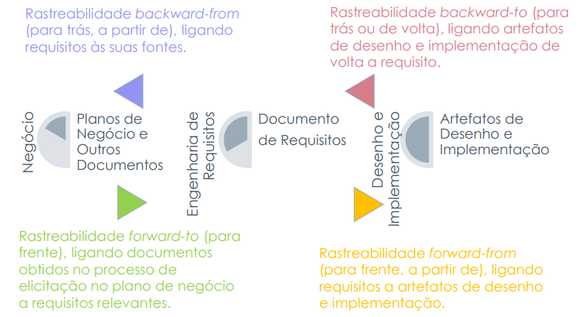

# Pós-Rastreabilidade

## <a>Histórico de Versão</a>
|Data|Data Prevista de Revisão|Versão|Descrição|Autor|Revisor|
| :----------: |:-----------:| :------: | :-----------: | :---------: |:---------: |
|23/01/2023|23/01/2023|1.0|Criação do documento| [João Lucas](https://github.com/HacKairos) | [-](https://github.com/) |

## <a>Introdução</a>
Rastreabilidade é uma característica de sistemas, nos quais requisitos são claramente ligados às suas fontes bem como aos artefatos criados durante o ciclo de vida de desenvolvimento do sistema. Lembrando que a criação desses artefatos é orientada à própria baseline de requisitos. 

Portanto Um elo é estabelecido entre as mudanças realizadas diante das necessidades dos usuários e a evolução dos sistemas de computação, estabelecendo-se uma base para o gerenciamento do conhecimento organizacional. 

Obs: Requisitos não podem ser efetivamente gerenciados sem rastreabilidade.

 Figura 1 - Análise

## <a>Pós-Rastreabilidade</a>
Requisitos sendo ligados a artefatos que são criados durante o ciclo de vida de desenvolvimento do sistema.

Também conhecida como: Gerência de Desenvolvimento de Software orientada à baseline de Requisitos.

## <a>Conclusão</a>

Rastreabilidade não é apenas um fator que auxilia a gerência dos requisitos. Adicionalmente, rastreabilidade pode ser vista como um fator que auxilia a gerência da qualidade.

## <a>Bibliografia</a>
SERRANO, Maurício; SERRANO, Milene; Requisitos - Aula 26.